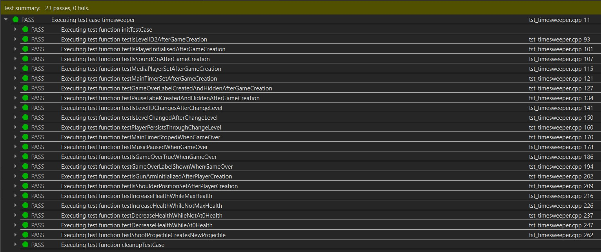
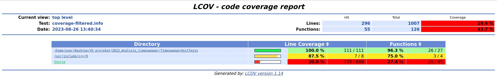
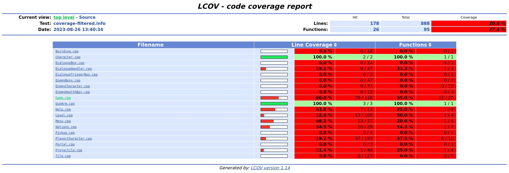
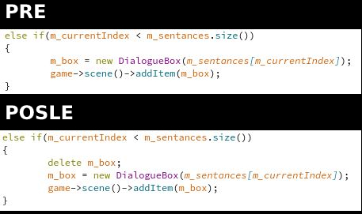
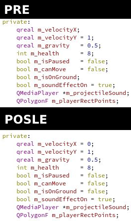

# Izvestaj projekta za kurs "Verifikacija softvera"

## Informacije o projektu koji se analizira
- Projekat koji se analizira se zove **Timesweeper** i može se pronaći na linku: https://gitlab.com/matf-bg-ac-rs/course-rs/projects-2020-2021/06-timesweeper
- Projekat je bio urađen za kurs "Razvoj softvera" u QtCreator razvojnom okruženju (jezik C++)
- Projekat predstavlja 2D platformer igricu u kojoj igrač putuje kroz portale koji ga vode kroz vreme kako bi zaustavio zle vanzemaljce koji su rasprostanjeni svuda po vremenu
## Uvod u analizu
- Analiza se vrši nad main granom projekta i to nad commit-om čiji je SHA: b1b27d201f6a60a855cb1a98c9624a16a6153951
- Analiza će se vršiti pomoću alata pokrenutih iz **terminala** kao i alatima pokrenutih direktno iz **QtCreator** okruženja
- Načini verifikacije koji su upotrebljeni:
  - **UnitTest** - pomoću QtTest biblioteke
  - **Gcov i Lcov** - za proveru pokrivenosti koda testovima
  - **Memcheck** - za proveru upotrebe i curenja memorije
  - **Clang-Tidy i Clazy** - za statičku analizu koda

## Unit testovi (QtTest)
- Unit testovi predstavljaju testove manjih jedinica koda, pretežno za proveru ispravnosti implementacije pojedinih delova
- Unit testovi predstavljaju vid dinamičke analize koda
- U idealnoj situaciji kod je napisan na način koji olakšava testiranje i unit testovi bi trebalo da pokrivaju sto veći procenat napisanog koda
- Za demonstraciju unit testova testirane su klase **Game** i **PlayerCharacter** kao dve najveće klase u projektu
### Testovi nad Game klasom
- void testIsLevelID2AfterGameCreation();
  - Kada se inicijalizuje novi instanca Game klase vrednost levelID promenljive treba da se promeni sa 1 na 2
- void testIsPlayerInitialisedAfterGameCreation();
  - Pri inicijalizaciji _Game_ instance potrebno je inicijalizovati njenu _player_ promenljivu tipa PlayerCharacter
- void testIsSoundOnAfterGameCreation();
  - Nakon inicijalizacije _Game_ instance zvuk bi trebalo da bude upaljen
- void testMediaPlayerSetAfterGameCreation();
  - Pri inicijalizaciji _Game_ instance potrebno je inicijalizovati njenu _music_ promenljivu tipa QMediaPlayer
- void testMainTimerSetAfterGameCreation();
  - Pri inicijalizaciji _Game_ instance potrebno je inicijalizovati njenu _mainTimer_ promenljivu tipa QTimer
- void testGameOverLabelCreatedAndHiddenAfterGameCreation();
  - Pri inicijalizaciji _Game_ instance potrebno je inicijalizovati i _GameOverLabel_ labelu koja je sakrivena i prikazuje se pri kraju igre 
- void testPauseLabelCreatedAndHiddenAfterGameCreation();
  - Pri inicijalizaciji _Game_ instance potrebno je inicijalizovati i _PauseLabel_ labelu koja je sakrivena i prikazuje se pri kraju igre
- void testIsLevelIDChangesAfterChangeLevel();
  - Kada se pozove funkcija _ChangeLevel_ potrebno je da se inkrementira promenljiva _levelID_ 
- void testIsLevelChangedAfterChangeLevel();
  - Kada se pozove funkcija _ChangeLevel_ potrebno je da se promeni i scena u _Game_ instanci
- void testPlayerPersistsThroughChangeLevel();
  - Kada se menja nivo potrebno je da se prenese isti _PlayerCharacter_ objekat kao i u prethodnom nivou
- void testMainTimerStopedWhenGameOver();
  - Kada se igra završi potrebno je da se zaustavi _mainTimer_ instance klase _Game_
- void testMusicPausedWhenGameOver();
  - Kada se igra završi potrebno je da se zaustavi muzika _music_ polja instance klase _Game_
- void testIsGameOverTrueWhenGameOver();
  - Kada se igra završi potrebno je postavi vrednost _isGameOver_ promenljive na true
- void testGameOverLabelShownWhenGameOver();
  - Kada se igra završi potrebno je prikazati _GameOverLabel_ labelu
### Testovi nad PlayerCharacter klasom
- void testIsGunArmInitializedAfterPlayerCreation();
  - Kada se inicijalizuje _PlayerCharacter_ instanca potrebno je da se inicijalizuje i njena _gunArm_ promenljiva tipa _GunArm_
- void testIsShoulderPositionSetAfterPlayerCreation();
  - Kada se inicijalizuje _PlayerCharacter_ instanca potrebno je da joj se podesi vrednost _shoulderPosition_ promenljive koja se koristi za određivanje pozicije ruke u prostoru
- void testIncreaseHealthWhileMaxHealth();
  - Kada se pozove _increaseHealth_ metod nad instancom _PlayerCharacter_ koja ima maksimalnu vrednost _m_health_ promenljive ne bi trebalo da dođe do promene   
- void testIncreaseHealthWhileNotMaxHealth();
  - Kada se pozove _increaseHealth_ metod nad instancom _PlayerCharacter_ koja nema maksimalnu vrednost _m_health_ promenljive trebalo bi da se uveća njena vrednost za 1 
- void testDecreaseHealthWhileNotAt0Health();
  - Kada se pozove _decreaseHealth_ metod nad instancom _PlayerCharacter_ koja ima više od 0 kao vrednost _m_health_ promenljive trebalo bi da se umanji njena vrednost za 1
- void testDecreaseHealthWhileAt0Health();
  - Kada se pozove _decreaseHealth_ metod nad instancom _PlayerCharacter_ koja ima 0 kao vrednost _m_health_ promenljive trebalo bi da dođe do emisije _playerIsDead()_ signala
- void testShootProjectileCreatesNewProjectile();
  - Kada se pozove _shootProjectile_ trebalo bi da se doda na scenu i time da se uveća broj item-a u njoj
### Rezultati izvršenih testova
- Ukupno je pozvano 23 testa od čega su 2 **init()** koji služi za inicijalizaciju nekih promenljivih pre svakog testa i **cleanup()** koji služi za čišćenje tih istih promenljivih između svaka 2 testa
- Ovime se okruženje održava istim između svaka 2 testa pa nije bitan redosled izvršavanja
- Izlaz pokretanja testova se može videti u narednoj slici

- Može se primetiti da svi testovi prolaze čime je potvrđena ispravna funkcionalnost navedenih zahteva
## Provera pokrivenosti pomoću Gcov i Lcov
- Kao što je već navedeno idealno je pokriti što veći procenat koda testovima
- Kako bismo proverili koliko koda je pokriveno pomoću testova možemo koristiti **Gcov** i **Lcov**
- Prvo treba podeseti podesiti _.pro_ file projekta sa testovima kako bi se uz _.o_ objekte u build folderu napravili i _.gcno_ file-ovi koji će služiti za proveru pokrivenosti i to radimo tako što dodajemo narednu liniju
```
CONFIG += gcov
```
- Qt okruženje ume da tumači tu liniju i dodaje funkcionalnost **Gcov** alata pri kompilaciji
- Nakon što se build-uje projekat, potrebno je pokrenuti sve testove, ovime će se pojaviti _.gcda_ file-ovi koji nam isto služe za proveru pokrivenosti
- Pozicioniramo se terminalom u folder u kojem želimo da pomoću **Lcov** alata napravimo _.info_ file
- Nakon toga pokrećemo sledeću komandu
```
lcov -d ../build-TimesweeperUnitTests-Desktop-Debug/ -c -o coverage.info
```
- Nakon toga možemo malo da filtriramo nepotrebne elemente samog Qt okruženja pomoću sledeće komande
```
lcov -r "coverage.info" "*Qt*.framework*" "*.h" "*/tests/*" "*Xcode.app*" "*.moc" "*moc_*.cpp" "*/test/*" "*/build*/*" -o "coverage-filtered.info"
```
- Sada možemo pomoću **genhtml** komande da generišemo folder-a sa html prikazom _coverage-filtered.info_ file-a sledećom komandom
```
genhtml -o coverage_html coverage-filtered.info
```
- Sada možemo da otvorimo _coverage_html/index.html_ file i videćemo prikaz sa procentima pokrenutog koda

- Sa slike možemo da vidimo da je pokrenuto 100% linija koda iz _TimesweeperUnitTests_ što je i očekivano jer se tu nalaze svi testovi
- Možemo isto videti i da je pokrivenost linija _Source_ folder-a (odnosno projekta koji se analizira) 20% što isto nije iznenađujuće jer se testovi odnose samo na 2 klase projekta, a ni one nisu 100% pokrivene testovima
- Ako pritisnemo link ka _Source_ možemo videti detaljniji pregled pokrivenosti po klasama

- Ovde možemo videti da je pokrivenost linija klase _Game_ 66.9%, ali samo 55% funkcija
- Takođe možemo videti da je pokrivenost linija klase _PlayerCharacter_ 19.2%, ali zato 37.5%
- Na osnovu ovih brojeva zaključujemo da bi trebalo pokriti veći broj funkcija testovima i zato je bitno pisati lako testabilan kod
## Provera upotrebe i curenja memorije pomoću Memcheck
- Za proveru memorije idealno je koristiti **Valgrind**, specifično njegov alat **Memcheck**
- Iako curenje memorije ne mora uvek da bude najveći problem u programu, ako se ne ispravi nagomilavanjem može dovesti do velikih problema čak i pada celog programa
- Pomoću **Memcheck**-a možemo proveriti da li postoji:
  - Curenje memorije
  - Upotreba neinicializovanih promenljivih
  - Pristupanje već oslobođenoj memoriji i dr.
- U kodu projekta može se primetiti nedostatak velikog broja destruktora i veliki nedostatak poziva **delete** funkcije tako da se može i očekivati veći broj problema sa memorijom
- Kako je u pitanju demonstracija upotrebe alata u ove svhre, biće prikazano rešenje jedne instance curenja memorije i jedne instance upotrebe neinicializovanih promenljivih
- Prvo treba izgraditi projekat što lako možemo uraditi pomoću Qt okruženja tako što podesimo da se pomoću Build pravi Release Build
- Nakon toga se terminalom pozicioniramo u folder u kojem želimo da čuvamo izlaz **Memcheck**-a i pokrećemo sledeću komandu
```
valgrind --leak-check=full --track-origins=yes --log-file=memcheck_output.txt ../06-timesweeper/build-timesweeper-Desktop-Release/timesweeper
```
- Ovime ćemo pokrenuti igricu sa prikačenim **Memcheck** alatom
- Nakon malo igranja i umiranja negde na pola prvog nivoa dobijamo izlaz apsurdne veličine uzrokovane time što u projektu praktično nema _delete_ i sličnih poziva
- Zbog veličine izlaza ne bih ga ostavljao u ovom izveštaju, već se može pronaći u sklopu ovog projekta na linku: https://github.com/MATF-Software-Verification/2023_Analysis_timesweeper/blob/main/Memcheck/memcheck_output.txt
- Neki isečci koji su vezani za napravljene izmene će biti naglašeni u daljem tekstu
- Kao što se da primetiti ovde zaista ima previše curenja memorije, tako da ćemo se fokusirati curenje vezano za **DialogueBox** i **DialogueHandler** klase kao i na upotrebu neinicializovanih vrednosti kod **PlayerCharacter** klase
### Curenje memorije kod DialogueBox i DialogueHandler klasa
- Primećujemo da postoji curenje memorije kod ovih klasa zbog ovakvih delova memcheck-ovog izveštaja
```
==17738== 30,924 (344 direct, 30,580 indirect) bytes in 1 blocks are definitely lost in loss record 12,352 of 12,418
==17738==    at 0x483BE63: operator new(unsigned long) (in /usr/lib/x86_64-linux-gnu/valgrind/vgpreload_memcheck-amd64-linux.so)
==17738==    by 0x4CD6C8C: QWidgetTextControl::QWidgetTextControl(QObject*) (in /usr/lib/x86_64-linux-gnu/libQt5Widgets.so.5.12.8)
==17738==    by 0x4DF0056: ??? (in /usr/lib/x86_64-linux-gnu/libQt5Widgets.so.5.12.8)
==17738==    by 0x4DF0220: QGraphicsTextItem::setPlainText(QString const&) (in /usr/lib/x86_64-linux-gnu/libQt5Widgets.so.5.12.8)
==17738==    by 0x117D4B: DialogueBox::DialogueBox(QPair<DialogueHandler::Speaker, QString>&) (in /home/user/Desktop/VS projekat/2023_Analysis_timesweeper/06-timesweeper/build-timesweeper-Desktop-Release/timesweeper)
==17738==    by 0x1182C1: DialogueHandler::advanceDialogue() (in /home/user/Desktop/VS projekat/2023_Analysis_timesweeper/06-timesweeper/build-timesweeper-Desktop-Release/timesweeper)
==17738==    by 0x1210E6: PlayerCharacter::keyPressEvent(QKeyEvent*) (in /home/user/Desktop/VS projekat/2023_Analysis_timesweeper/06-timesweeper/build-timesweeper-Desktop-Release/timesweeper)
==17738==    by 0x4DEDC54: QGraphicsItem::sceneEvent(QEvent*) (in /usr/lib/x86_64-linux-gnu/libQt5Widgets.so.5.12.8)
==17738==    by 0x4E1182D: QGraphicsScene::keyPressEvent(QKeyEvent*) (in /usr/lib/x86_64-linux-gnu/libQt5Widgets.so.5.12.8)
==17738==    by 0x4E23154: QGraphicsScene::event(QEvent*) (in /usr/lib/x86_64-linux-gnu/libQt5Widgets.so.5.12.8)
==17738==    by 0x4AE6A65: QApplicationPrivate::notify_helper(QObject*, QEvent*) (in /usr/lib/x86_64-linux-gnu/libQt5Widgets.so.5.12.8)
==17738==    by 0x4AF00EF: QApplication::notify(QObject*, QEvent*) (in /usr/lib/x86_64-linux-gnu/libQt5Widgets.so.5.12.8)
```
- Ispostavlja se da se pri izmeni trenutno aktivnog **DialogueBox** objekta od strane **DialogueHandler**-a on ne briše već samo biva zamenjen novim
- Zbog toga se menja vrednost jedinog pokazivača ka tom segmentu memorije i on postaje nedostižan
- Da bismo rešili dodajemo poziv za _delete_ funkciju u kod odmah pre zamene **DialogueBox**-a

- Na ovaj način imamo brisanje objekta na koji pokazuje _m_box_ promenljiva odmah pre izmene njene vrednosti, a kako je _delete_ bezbedan za pozivanje nad _nullptr_ nije nepohodno ni da proveravamo da li pokazuje na pravi objekat ili ne
### Upotreba neinicializovanih vrednosti promenljive u PlayerCharacter klasi
- Primećujemo da postoji upotreba neinicializovanih vrednosti promenljive u PlayerCharacter klasi zbog ovog dela memcheck-ovog izveštaja
```
==17738== Conditional jump or move depends on uninitialised value(s)
==17738==    at 0x11FC57: PlayerCharacter::jump() (in /home/user/Desktop/VS projekat/2023_Analysis_timesweeper/06-timesweeper/build-timesweeper-Desktop-Release/timesweeper)
==17738==    by 0x12188E: PlayerCharacter::advance(int) (in /home/user/Desktop/VS projekat/2023_Analysis_timesweeper/06-timesweeper/build-timesweeper-Desktop-Release/timesweeper)
==17738==    by 0x4E0B446: QGraphicsScene::advance() (in /usr/lib/x86_64-linux-gnu/libQt5Widgets.so.5.12.8)
==17738==    by 0x4E151C1: ??? (in /usr/lib/x86_64-linux-gnu/libQt5Widgets.so.5.12.8)
==17738==    by 0x58B41CF: QMetaObject::activate(QObject*, int, int, void**) (in /usr/lib/x86_64-linux-gnu/libQt5Core.so.5.12.8)
==17738==    by 0x58C13ED: QTimer::timeout(QTimer::QPrivateSignal) (in /usr/lib/x86_64-linux-gnu/libQt5Core.so.5.12.8)
==17738==    by 0x58B4BC4: QObject::event(QEvent*) (in /usr/lib/x86_64-linux-gnu/libQt5Core.so.5.12.8)
==17738==    by 0x4AE6A65: QApplicationPrivate::notify_helper(QObject*, QEvent*) (in /usr/lib/x86_64-linux-gnu/libQt5Widgets.so.5.12.8)
==17738==    by 0x4AF00EF: QApplication::notify(QObject*, QEvent*) (in /usr/lib/x86_64-linux-gnu/libQt5Widgets.so.5.12.8)
==17738==    by 0x5888809: QCoreApplication::notifyInternal2(QObject*, QEvent*) (in /usr/lib/x86_64-linux-gnu/libQt5Core.so.5.12.8)
==17738==    by 0x58DF77F: QTimerInfoList::activateTimers() (in /usr/lib/x86_64-linux-gnu/libQt5Core.so.5.12.8)
==17738==    by 0x58E006B: ??? (in /usr/lib/x86_64-linux-gnu/libQt5Core.so.5.12.8)
==17738==  Uninitialised value was created by a heap allocation
==17738==    at 0x483BE63: operator new(unsigned long) (in /usr/lib/x86_64-linux-gnu/valgrind/vgpreload_memcheck-amd64-linux.so)
==17738==    by 0x11B7AB: Game::Game() (in /home/user/Desktop/VS projekat/2023_Analysis_timesweeper/06-timesweeper/build-timesweeper-Desktop-Release/timesweeper)
==17738==    by 0x11D8B4: Menu::Menu(QWidget*) (in /home/user/Desktop/VS projekat/2023_Analysis_timesweeper/06-timesweeper/build-timesweeper-Desktop-Release/timesweeper)
==17738==    by 0x117618: main (in /home/user/Desktop/VS projekat/2023_Analysis_timesweeper/06-timesweeper/build-timesweeper-Desktop-Release/timesweeper)
```
- Kada se pogleda **PlayerCharacter.h** primećuje se da je većina promenljivih inicijalizovana od samog početka, mada ima par njih koje nisu i one se koriste u _jump()_ i _walk()_ funkcijama i to su _m_isOnGround_ i _m_velocityX_
- Ove promenljive se vremenom inicijalizuju ali kako se _advance()_ funkcija poziva od samog početka igre, oni moraju da budu inicijalizovani od starta
- Kako bismo ispravili ovu grešku jednostavno inicijalizujemo vrednosti ovih promenljivih ovako


### Memcheck rezultati
- Jasno je da ovako mali broj izmena neće napraviti neverovatnu razliku posebno u projektu ovolikih razmera, ali kako u projektu praktično nema poziva za čišćenje memorije, otkrivanja uzroka i ispravljanje svih grešaka bi bio preveliki posao za ovu demonstraciju
- Da bismo videli rezultate ovih izmena pravimo novi izveštaj tako što opet pozivamo memcheck sledećom komandom
```
valgrind --leak-check=full --track-origins=yes --log-file=memcheck_output_after_changes.txt ../06-timesweeper/build-timesweeper-Desktop-Release/timesweeper
```
- Nakon izmena i dalje dobijamo ogroman izveštaj koji se može naći na linku: https://github.com/MATF-Software-Verification/2023_Analysis_timesweeper/blob/main/Memcheck/memcheck_output_after_changes.txt
- Može se primetiti da je izveštaj ipak malo kraći
- Takođe se može primetiti da više nema napomene o **DialogueHandler** i **DialogueBox** klasa u izveštaju kao i da nema primedbi da **PlayerCharacter** klasa koristi neinicijalizovane vrednosti
- Iz toga zaključujemo da su napravljene izmene ispravile neke od mnogobrojnih grešaka sa memorijom koje su prisutne u ovom projektu
